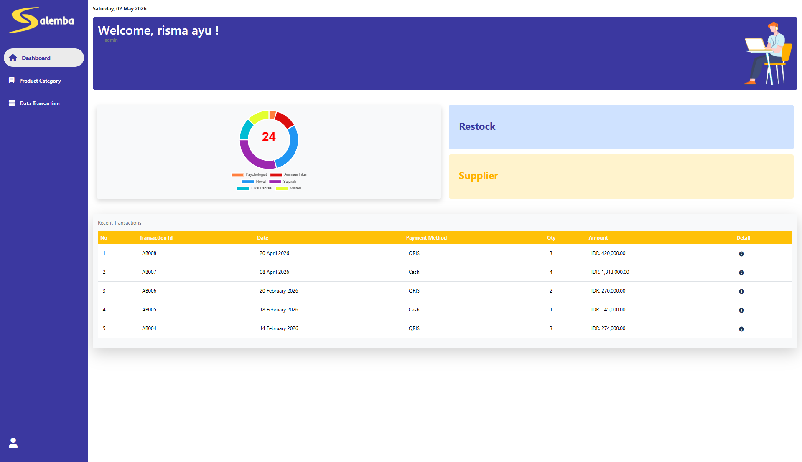

Inventory Management Application

Key features include real-time inventory information for customers, automated restocking invoices with a redirect to the suppliers gmail, restocking history filters by years, restocking status tracking and sales report filters based on month and year. 
As a Fullstack Developer, I built this application using Laravel, MySQL, and Bootstrap.
This app helps customers check available stock without having to ask the cashier, and helps administrators speed up the restocking process, generate reports, and easily access transaction history

